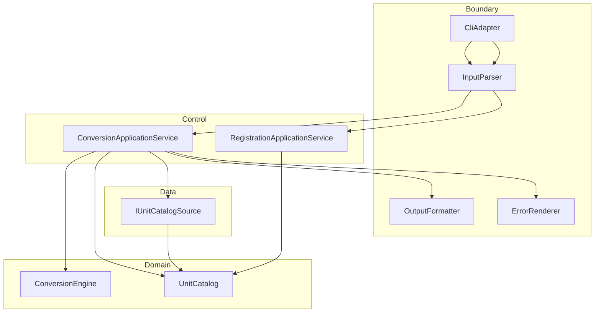

# UnitConverter_12

**meter 기준 길이 단위 변환 C++ 콘솔 학습 시스템** — C++·클린 아키텍처·TDD 학습자가 **계약·테스트·레이어 분리(BCE)** 로 확장 가능한 구조를 체득하기 위한 실습 저장소입니다.


---

## 목차

- [개요 (Overview)](#개요-overview)
- [빠른 시작 (Quick Start)](#빠른-시작-quick-start)
- [지원 단위 및 비율](#지원-단위-및-비율)
- [입력 형식 계약](#입력-형식-계약)
- [아키텍처](#아키텍처)
- [테스트 실행](#테스트-실행)
- [설정 파일 (JSON/YAML)](#설정-파일-jsonyaml)
- [출력 포맷](#출력-포맷)
- [기여 가이드 (Contributing)](#기여-가이드-contributing)
- [라이선스](#라이선스)
- [관련 문서](#관련-문서)

---

## 개요 (Overview)

### 이 프로젝트가 해결하는 문제

출발점은 **입력 파싱·비율 분기·stdout 출력이 한 진입점에 결합**된 절차형 변환기입니다. 단위·출력 포맷·설정이 늘 때 **변환 핵심까지 수정**되는 구조 리스크가 있으며, 비율 상수가 여러 분기에 중복됩니다. 본 프로젝트는 “환산식 한 줄 추가”가 아니라 **변경 축을 분리**하고 **계약·테스트로 고정**하는 문제를 다룹니다.

### 주요 학습 목표

| 목표 | 내용 |
|------|------|
| **OCP** | 신규 단위·포맷 추가 시 `ConversionEngine` 시그니처 변경 없음 |
| **SRP** | 파싱 / 검증 / Catalog / Engine / Formatter / 설정 로드 책임 분리 |
| **BCE** | Domain · Control · Boundary · Data 레이어와 의존 방향 준수 |
| **TDD** | Domain RED → Boundary 계약 → Data fixture → E2E, 스냅샷·커버리지 게이트 |

### PRD와의 연결

요구사항·인수 기준·회귀 규칙의 정본은 **[제품 요구사항 문서 (PRD v1.0)](docs/PRD.md)** 입니다. 구현·테스트·문서 변경 시 PRD §3(계약)·§7(인수·회귀)을 먼저 확인하세요. 작업 추적은 **[To-Do 리스트](docs/TODO.md)** 를 참고하세요.

---

## 빠른 시작 (Quick Start)

### 사전 조건

| 항목 | 요구 |
|------|------|
| C++ | **C++17** 이상 |
| 빌드 | **CMake** 3.16+ |
| 컴파일러 | g++ / clang++ (로컬 콘솔) |
| 테스트 | **Catch2** v2 또는 v3 (CMake FetchContent 또는 시스템 설치) |

> **v1.0 진행 상태**: CMake·Catch2 멀티 타깅은 [To-Do Must](docs/TODO.md) 항목입니다. 아래 명령은 PRD §4.1 **목표 빌드 절차**이며, 골격 완료 후 동일하게 동작해야 합니다.

### 빌드 & 실행 (목표 절차)

```bash
cmake -S . -B build -DCMAKE_BUILD_TYPE=Debug
cmake --build build
ctest --test-dir build --output-on-failure
./build/unit_converter_cli
```

프로그램이 입력을 기다리면 한 줄을 입력합니다.

```text
meter:5.0
```

### 예시 입출력

**입력**

```text
meter:5.0
```

**출력 (table, 기본 포맷)** — target 값은 소수 1자리 half-up, source는 입력 그대로(POL-OUT):

```text
5.0 meter = 16.4 feet
5.0 meter = 5.5 yard
```

**종료 코드**: `0` · **stderr**: (비어 있음)

### 레거시 단일 파일 빌드 (참고)

리팩터링 전 절차형 출발점만 확인할 때:

```bash
g++ -std=c++17 -o UnitConverter UnitConverter.cpp
./UnitConverter
```

v1.0 인수는 CMake·테스트·BCE 구조 기준입니다.

---

## 지원 단위 및 비율

모든 환산은 **meter 허브**(`meters_per_unit`: `1 {unit} = k meter`)로 수행합니다.

| 단위명 | 식별자 | meter 기준 비율 (k) | 출처 |
|--------|--------|---------------------|------|
| meter | `meter` | `1.0` | 기준 단위 (PRD §5.1) |
| feet | `feet` | `0.3048` | `1 meter = 3.28084 feet` (README·PRD) |
| yard | `yard` | `0.9144` | `1 meter = 1.09361 yard` (README·PRD) |

**검증 규칙**: 환산 TC 허용오차 `|a−e| ≤ max(1e−9, |e|×1e−9)`. feet↔yard는 meter 경유와 일치해야 합니다.

---

## 입력 형식 계약

### 정상 입력 (CONVERT)

형식: `{unit}:{value}`

| 예시 | 설명 |
|------|------|
| `meter:2.5` | README 기본 예시 |
| `feet:8.2` | 원 입력 보존(POL-OUT): 모든 줄 `8.2 feet =` 로 시작 |
| `yard:1` | 양의 정수 값 |

- `unit`: `[A-Za-z][A-Za-z0-9_]*`
- `value`: `0 < value < +∞` (유한 실수)

### 비정상 입력 (대표 3건)

| 입력 | exit | stderr 패턴 (치환 외 고정) |
|------|------|---------------------------|
| `meter2.5` (콜론 없음) | 1 | `Invalid format. Use unit:value (ex: meter:2.5)` |
| `meter:abc` (비수치) | 1 | `Invalid number: abc` |
| `meter:-2.5` (음수, POL-NEG) | 1 | `Value must be positive: -2.5` |

**추가 거부**: `meter:0` · 미등록 `stone:1` → `Unknown unit: stone` (stdout 변환 없음).

### 동적 등록 (REGISTER)

```text
REGISTER 1 cubit = 0.4572 meter
```

성공 후 동일 프로세스에서 `cubit:2` 사용 가능 (세션 내 Catalog만 갱신, 디스크 저장 없음).

---

## 아키텍처

### BCE 레이어 (Mermaid)



### 의존성 방향

| 허용 | 금지 |
|------|------|
| Boundary → Control → Domain | Domain → Boundary / Data |
| Data → Domain (정의 로드만) | Boundary에서 환산식 복제 |
| Formatter·Parser는 Domain Mock으로 계약 테스트 | 테스트 없는 계약 변경 |

### 새 단위 추가 방법 (코드 최소화)

1. **설정**: `config/units.json`의 `units[]`에 `{ "name": "...", "meters_per_unit": <k> }` 추가 — **Engine 수정 없음**.
2. **런타임**: `REGISTER 1 {unit} = {k} meter` 한 줄 입력 — 동일 프로세스 Catalog 갱신.
3. **검증**: Domain TC에 k·환산 1건 추가; Golden trio 스냅샷 **변경 없음** 확인 (PRD RR-04).
4. **금지**: feet↔yard 직접 쌍 하드코딩, `ConversionEngine` 시그니처 변경 (PRD NG-03, G-04).

---

## 테스트 실행

### 테스트 프레임워크

**Catch2** — Domain / Boundary / Data / 통합 타깅 분리 (PRD §4.1).

### 명령

```bash
cmake -S . -B build -DCMAKE_BUILD_TYPE=Debug -DENABLE_COVERAGE=ON
cmake --build build
ctest --test-dir build --output-on-failure
```

커버리지 리포트 생성(도구는 팀 환경에 맞게 `gcov`/`llvm-cov` 등 선택):

```bash
# 예: llvm-cov (환경에 따라 조정)
ctest --test-dir build
# 이후 프로젝트에 정의된 coverage 타깅 실행
```

### 커버리지 목표 (PRD §4.3)

| 레이어 | Line | Branch |
|--------|------|--------|
| Domain | ≥ 95% | ≥ 90% |
| Boundary | ≥ 90% | ≥ 85% |
| Data | ≥ 85% | ≥ 80% |
| Control | ≥ 80% | ≥ 75% |
| **전체** | ≥ 88% | — |

**회귀**: Golden trio `{1.0, 2.5, 0.1}` × `meter:` table 스냅샷 diff 0 · 계약 TC ≥ 10 · stderr 메시지 바이트 고정 (PRD §7.2).

---

## 설정 파일 (JSON/YAML)

### 위치

```text
config/units.json
```

기동 시 `--config config/units.json` (미지정 시 InMemory 기본 3단위, §5.1과 동일 수치).

### 형식 예시 (JSON)

```json
{
  "schema_version": 1,
  "base_unit": "meter",
  "units": [
    { "name": "meter", "meters_per_unit": 1.0 },
    { "name": "feet", "meters_per_unit": 0.3048 },
    { "name": "yard", "meters_per_unit": 0.9144 }
  ]
}
```

| 규칙 | 실패 시 |
|------|---------|
| `schema_version` = 1, `base_unit` = `meter` | `CONFIG_LOAD_FAILED`, exit 2 |
| `units[]` 비어 있음·중복 name | exit 2, fallback 없음 |
| 파일 깨짐·없음 | `Failed to load config: {path}` |

YAML은 동일 키·타입 (프로젝트에서 1종 선택).

### 동적 단위 등록 예시 (PRD §5.3)

```text
REGISTER 1 cubit = 0.4572 meter
cubit:2
```

**기대**: meter 환산 ≈ `0.9144` (허용오차 규칙 내). 등록 후에도 `meter:2.5` Golden 출력 **불변**.

---

## 출력 포맷

공통 **POL-OUT**: 모든 포맷에서 `source`는 사용자 입력 unit·value 그대로. table만 target 1dp half-up.

### 콘솔 (table, 기본)

```text
2.5 meter = 8.2 feet
2.5 meter = 2.7 yard
```

### JSON (`--format json`)

```json
{
  "source": { "unit": "meter", "value": 2.5 },
  "conversions": [
    { "unit": "feet", "value": 8.2021 },
    { "unit": "yard", "value": 2.7340 }
  ]
}
```

JSON `conversions[].value`는 1dp가 아닌 계산 정밀도(허용오차 규칙).

### CSV (`--format csv`)

```csv
source_unit,source_value,target_unit,target_value
meter,2.5,feet,8.2021
meter,2.5,yard,2.7340
```

### 포맷 선택

```bash
./build/unit_converter_cli --format table
./build/unit_converter_cli --format json
./build/unit_converter_cli --format csv
```

미지정 시 `table`. 동일 입력·Catalog에서 **target 단위 집합**은 포맷 간 동일해야 합니다.

---

## 기여 가이드 (Contributing)

### 계약 변경 금지 원칙

| 규칙 ID | 내용 |
|---------|------|
| RR-01 | 기본 3단위 `meters_per_unit` 변경 시 관련 TC **의도적 FAIL** 되도록 유지 |
| RR-02 | Golden trio table 스냅샷 PR마다 diff 0 |
| RR-03 | §3.3 에러 message 패턴 바이트 변경 금지(변경 시 스냅샷·PRD·Gherkin 동시 수정) |
| RR-04 | REGISTER 후 `meter:2.5` 스냅샷 diff 0 |
| RR-05 | POL-NEG·POL-OUT·Background 수치 변경 시 **PRD 버전 bump** + Gherkin 동시 수정 |

계약·수치·문구 변경은 **[PRD](docs/PRD.md)** 먼저 수정한 뒤 코드·테스트를 따릅니다.

### 테스트 없는 PR 거부 정책

- Domain 로직 변경 → Domain TC 필수  
- 파싱·stderr·stdout·포맷 변경 → Boundary 계약 TC 또는 스냅샷 필수  
- 설정 스키마 변경 → Data fixture TC 필수  
- **테스트·스냅샷·커버리지 증거 없는 PR은 리뷰하지 않음**

### 커밋 메시지 컨벤션

```text
<type>: <한 줄 요약>

type: feat | fix | test | refactor | docs | chore
예: test: add GH-6 negative value boundary snapshot
예: docs: align README ratios with PRD 5.1
```

---

## 라이선스

**MIT License** — 학습·실습·포크 용도. 상세 문구는 저장소 `LICENSE` 파일(추가 시)을 따릅니다.

---

## 관련 문서

| 문서 | 설명 |
|------|------|
| [docs/PRD.md](docs/PRD.md) | 제품 요구사항 정본 (Phase 5) |
| [docs/TODO.md](docs/TODO.md) | v1.0 작업·마일스톤·회귀 체크리스트 |
| [docs/requirements.md](docs/requirements.md) | Phase 4 요구사항 패키지 (참고) |

---

## 6시간 실습 Activities (참고)

| 단계 | 시간 | 내용 |
|------|------|------|
| 1 | 0.5h | 문제 코드·요구 분석 |
| 2 | 2h | OCP/SRP·입력 검증·Domain/Boundary |
| 3 | 0.5h | 변환·검증 TC |
| 4 | 2h | 설정 외부화·동적 등록·출력 포맷 |
| 5 | 1h | 회고·발표 (SC·커버리지·스냅샷 증거) |

진행 상황은 [docs/TODO.md](docs/TODO.md) 마일스톤 M0~M4와 동기화하세요.
