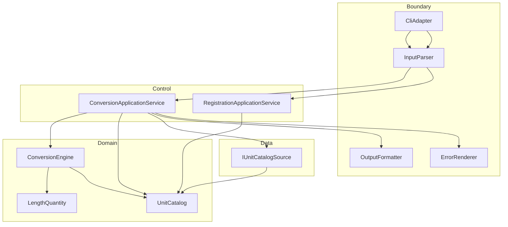

# UnitConverter_12

**meter 기준 길이 단위 변환 C++ 콘솔 학습 시스템** — C++·클린 아키텍처·TDD 학습자가 **계약·테스트·레이어 분리(BCE)** 로 확장 가능한 구조를 체득하기 위한 실습 저장소입니다.

> 본 README는 **완성 제품 매뉴얼**이 아니라, 현재 단계(**TDD RED: ① 개념 정의 · ② 실패 테스트**)에서 학습자가 따라 할 **워크플로·계약·문서 정본**을 중심으로 작성되었습니다.


---

## 목차

- [개요 (Overview)](#개요-overview)
- [현재 진행 상태](#현재-진행-상태)
- [TDD × Cursor AI 워크플로우 (RED 단계)](#tdd--cursor-ai-워크플로우-red-단계)
- [빠른 시작 (Quick Start)](#빠른-시작-quick-start)
- [지원 단위 및 비율](#지원-단위-및-비율)
- [입력 형식 계약](#입력-형식-계약)
- [아키텍처](#아키텍처)
- [테스트 실행](#테스트-실행)
- [설정 파일 (JSON/YAML)](#설정-파일-jsonyaml)
- [출력 포맷](#출력-포맷)
- [기여 가이드 (Contributing)](#기여-가이드-contributing)
- [라이선스](#라이선스)
- [관련 문서](#관련-문서)
- [6시간 실습 Activities](#6시간-실습-activities)

---

## 개요 (Overview)

### What / Who / Why ([PRD §1.1](docs/PRD.md))

| 항목 | 내용 |
|------|------|
| **What** | meter 기준 길이 단위를 변환하는 C++ 콘솔 학습 시스템 |
| **Who** | C++·클린 아키텍처·TDD를 학습하는 개발자 |
| **Why** | 환산 알고리즘이 아니라 **계약·테스트·BCE 레이어 분리**로 6시간 실습 안에 확장 가능한 구조를 체득 |

### 이 프로젝트가 해결하는 문제

출발점은 **입력 파싱·비율 분기·stdout 출력이 한 진입점에 결합**된 절차형 변환기(`UnitConverter.cpp`)입니다. 비율 상수가 `if (unit == "feet")` 분기마다 중복되고, 단위·포맷·설정이 늘 때 **변환 핵심까지 수정**되는 구조 리스크가 있습니다. 학습 목표는 “곱셈 한 줄”이 아니라 **입출력 계약 고정 → RED 테스트 → Domain/Boundary/Data 분리 → 회귀 스냅샷** 순서입니다.

### 주요 학습 목표

| 목표 | 내용 |
|------|------|
| **OCP** | 신규 단위·포맷 추가 시 `ConversionEngine` 시그니처 변경 없음 (목표, [PRD G-04](docs/PRD.md)) |
| **SRP** | 파싱 / 검증 / Catalog / Engine / Formatter / 설정 로드 책임 분리 |
| **BCE** | Domain · Control · Boundary · Data 레이어와 의존 방향 준수 |
| **TDD** | Concept → Failing Test(RED) → Minimum Implementation(GREEN) → Refactor → Git 추적(C2C) |
| **C2C** | PRD invariant → Catch2 TC ID → 커밋 메시지로 추적 가능하게 유지 |

### PRD와의 연결

요구사항·인수 기준·회귀 규칙의 **단일 진실 공급원**은 **[제품 요구사항 문서 (PRD v1.0)](docs/PRD.md)** 입니다. Phase 4 원본·6시간 Activities는 **[requirements.md](docs/requirements.md)** 를 참고하되, **충돌 시 PRD가 우선**합니다. 작업 추적은 **[To-Do 리스트](docs/TODO.md)** 를 따르세요.

---

## 현재 진행 상태

| 마일스톤 | 범위 | 상태 | 비고 |
|----------|------|------|------|
| **M0** 문서·계약 | PRD, TODO, requirements, README, `.cursorrules` 뼈대 | ✅ **완료** | 2026-05-20 기준 [TODO Done](docs/TODO.md) |
| **M1** Domain + TDD RED | 개념 정의(①) · 실패 Catch2(②) · 이후 GREEN | 🔶 **RED 진행 중** | CMake/Catch2 골격·BCE 구현은 **Must TODO 미착수** |
| **M2** Boundary·table v1 | CONVERT·POL-NEG·Formatter·AC-01~03 | 🔲 대기 | M1 GREEN 이후 |
| **M3** 권장 기능 | config, REGISTER, json/csv | 🔲 대기 | 실습 +2h 목표 |
| **M4** v1.0 릴리스 | Must 전항·회귀 체크리스트·AC-01~07 | 🔲 대기 | 인수 전 |

*T = 실습 시작일(팀별). [TODO 마일스톤](docs/TODO.md) 일정과 동기화.*

### 문서 ↔ 구현 갭 (의도적)

| 항목 | 문서(정본) | 저장소 현재 |
|------|------------|-------------|
| 빌드·테스트 | CMake + Catch2 + `ctest` 4타깅 ([PRD §4.1](docs/PRD.md)) | **미구현** — [Must TODO](docs/TODO.md) 첫 항목 |
| BCE 소스 | Domain/Boundary/Data/Control 분리 | **미구현** — `UnitConverter.cpp` 절차형만 동작 |
| RED 테스트 | Catch2 Domain/Boundary 계약 TC | **작성 예정** — RED 단계에서 `ctest` **FAIL이 정상** |
| v1.0 인수 | AC-01~07, Golden trio | **미달** — GREEN·REFACTOR 이후 목표 |
| 레거시 실행 | g++ 단일 파일 | ✅ `UnitConverter.cpp` 참고용만 |

---

## TDD × Cursor AI 워크플로우 (RED 단계)

교육 슬라이드 **「RBAC × TDD × Cursor AI — 실전 워크플로우」** 와 동일한 5단계 흐름을 본 저장소(단위 변환 BCE)에 적용합니다. **지금은 ①~②(RED)만 수행**하고, ③~⑤는 다음 단계 요약입니다.

### C2C Traceability

```text
Concept(개념) → Failing Test(RED) → Minimum Implementation(GREEN) → Refactoring → Git commit
```

각 단계에서 **PRD invariant → Catch2 `TEST_CASE` 태그/제목 → 커밋 메시지**를 한 줄로 연결합니다.

### 5단계 매핑 (RBAC 예시 → UnitConverter)

| 단계 | RBAC 예시 | UnitConverter (본 저장소) | 현재 |
|------|-----------|---------------------------|------|
| **① 개념 정의** (RED 준비) | Role·Permission Entity (ECB) | `LengthQuantity`, `MetersPerUnit`, `UnitCatalog`, `ConversionEngine` — meter 허브 환산식·불변식만 정의, 구현은 최소 헤더 스켈레톤 | **진행 중** |
| **② 실패 테스트** (RED) | viewer 삭제 403, 메뉴 visibility pytest RED | Catch2: 환산 불변식·POL-NEG·파싱 계약 TC 먼저 작성 → `ctest`에서 **의도적 FAIL** 확인 | **진행 중** |
| **③ 최소 구현** (GREEN) | `is_visible()` 최소 통과 | RED TC만 통과하는 최소 Domain/Boundary | 다음 |
| **④ 리팩터** (REFACTOR) | JWT·DB 권한 정리 | Catalog 단일 출처, Formatter 분리, `config/units.json` 로드 | 다음 |
| **⑤ Git 커밋·추적** | `feat: RBAC menu visibility control` | `test: add GH-6 negative value boundary RED` → `feat: domain conversion engine GREEN` | 다음 |

### Cursor 프롬프트 예시 (2건)

**① 개념 정의 (RED 준비)** — Domain Entity만, 구현 최소:

```text
PRD §4.2 BCE에 맞게 Domain Entity를 정의해 주세요.
책임: LengthQuantity, MetersPerUnit, UnitCatalog, ConversionEngine.
불변식: meter 허브 target = source × (k_source / k_target), POL-NEG는 Boundary에서 Domain 호출 전 거부.
구현은 헤더 스켈레톤과 환산식 주석만, GREEN 로직은 넣지 마세요.
```

**② 실패 테스트 (RED)** — Catch2 Domain TC만:

```text
PRD §5.1·§4.3에 맞는 Catch2 Domain 테스트를 먼저 작성해 주세요.
- bootstrap_default_three_units 후 meter:2.5 → feet ≈ 8.2 (1dp WithinAbs 0.05), yard ≈ 2.7
- 음수 value create 실패
- feet↔yard가 meter 경유로 일치
구현 코드는 추가하지 말고, ctest에서 FAIL이 나오는지 확인할 수 있게 해 주세요.
```

### Catch2 RED 스니펫 (pytest 대신 Catch2)

RED 단계에서는 **스텁·링크 실패·assert 실패가 정상**입니다. 아래는 계약을 고정하는 **목표 테스트**이며, GREEN 전까지 통과하지 않아도 됩니다.

```cpp
TEST_CASE("meter 2.5 converts to feet 8.2 at 1dp", "[domain][red]") {
    auto catalog = bootstrap_default_three_units(); // meter, feet, yard — PRD §5.1
    ConversionEngine engine(catalog);
    auto result = engine.convert(LengthQuantity::create("meter", 2.5));
    REQUIRE_THAT(result.value_for("feet"), WithinAbs(8.2, 0.05));
}

TEST_CASE("meter:-2.5 rejected before conversion", "[boundary][red]") {
    auto [exit_code, stderr_text] = run_cli("meter:-2.5");
    REQUIRE(exit_code == 1);
    REQUIRE(stderr_text == "Value must be positive: -2.5\n");
}
```

추가 RED 후보: `yard` 2.7 (1dp) · `feet`↔`yard` meter 경유 일치 · `LengthQuantity::create` 음수/0 실패.

### 용어 박스

| 용어 | 의미 |
|------|------|
| **BCE** | Boundary · Control · Domain · Data 분리. Domain은 Boundary/Data에 의존하지 않음 ([PRD §4.2](docs/PRD.md)) |
| **C2C Traceability** | PRD invariant → Catch2 TC → Git 커밋으로 개념-테스트-구현 추적 |
| **RED** | 계약을 테스트로 먼저 고정하고, 구현 전 **의도적 실패**를 확인하는 TDD 단계 |
| **POL-NEG** | `0 < value < +∞` 유한 실수만 허용; 0·음수·NaN·Inf 거부 ([PRD §3.3](docs/PRD.md)) |
| **POL-OUT** | 성공 출력에서 source unit·value를 **사용자 입력 그대로** 보존; table target만 1dp half-up ([PRD §6.1](docs/PRD.md)) |

### ③~⑤ 다음 단계 (요약)

- **GREEN**: RED TC만 통과하는 최소 `ConversionEngine`·Boundary 파서.
- **REFACTOR**: 비율 단일 출처(`UnitCatalog`), Formatter·`config/units.json` ([Must/Should TODO](docs/TODO.md)).
- **Git**: `test:` / `feat:` / `refactor:` 접두와 GH·invariant ID를 커밋 본문에 명시.

---

## 빠른 시작 (Quick Start)

### 사전 조건 (목표 스택, [PRD §4.1](docs/PRD.md))

| 항목 | 요구 |
|------|------|
| C++ | **C++17** 이상 |
| 빌드 | **CMake** 3.16+ |
| 컴파일러 | g++ / clang++ (로컬 콘솔) |
| 테스트 | **Catch2** v2 또는 v3 |

> **RED 시점 안내**: CMake·Catch2·`ctest` 골격이 아직 없으면 아래 명령은 **목표 절차**입니다. 골격 추가 직후 `ctest`가 **RED(실패)로 끝나는 것이 정상**이며, 전건 GREEN은 M1 후반~M2 이후 목표입니다.

### 빌드 & 실행 (목표 절차)

```bash
cmake -S . -B build -DCMAKE_BUILD_TYPE=Debug
cmake --build build
ctest --test-dir build --output-on-failure
./build/unit_converter_cli
```

프로그램이 입력을 기다리면 한 줄을 입력합니다.

```text
meter:5.0
```

**기대 출력 (table, GREEN 이후)** — PRD §6.2·POL-OUT:

```text
5.0 meter = 16.4 feet
5.0 meter = 5.5 yard
```

**README·인수 대표 예시** (`meter:2.5`, [PRD §7.1 AC-02](docs/PRD.md)):

```text
2.5 meter = 8.2 feet
2.5 meter = 2.7 yard
```

**종료 코드**: `0` · **stderr**: (비어 있음)

### 레거시 단일 파일 빌드 (참고만)

[requirements.md](docs/requirements.md) 출발점. **v1.0 인수·회귀는 CMake·ctest·BCE 기준**입니다.

```bash
g++ -std=c++17 -o UnitConverter UnitConverter.cpp
./UnitConverter
```

`UnitConverter.cpp`는 파싱·분기·출력이 한 `main`에 있으며, 비율이 분기마다 하드코딩되어 있습니다([기술 부채](docs/TODO.md)).

---

## 지원 단위 및 비율

모든 환산은 **meter 허브** (`meters_per_unit` **k**: `1 {unit} = k meter`)로 수행합니다. feet↔yard **직접 쌍 하드코딩 금지** ([PRD NG-03](docs/PRD.md)).

| 단위명 | 식별자 | k (`meters_per_unit`) | 관계식 |
|--------|--------|------------------------|--------|
| meter | `meter` | `1.0` | 기준 |
| feet | `feet` | `0.3048` | `1 meter = 3.28084 feet` |
| yard | `yard` | `0.9144` | `1 meter = 1.09361 yard` |

**환산식**: `target_value = source_value × (k_source / k_target)`

**대표 예시** `meter:2.5` → table 1dp half-up ([PRD §6.1](docs/PRD.md)):

| target | 표시값 |
|--------|--------|
| feet | `8.2` |
| yard | `2.7` |

**검증**: Domain TC 허용오차 `|a−e| ≤ max(1e−9, |e|×1e−9)`; feet↔yard는 meter 경유와 일치.

---

## 입력 형식 계약

계약 정본: [PRD §3.2·§3.3](docs/PRD.md). 아래는 요약 표입니다.

### 정상 입력 (CONVERT)

형식: `{unit}:{value}`

| 규칙 | 내용 |
|------|------|
| `unit` | `[A-Za-z][A-Za-z0-9_]*` |
| `value` | `0 < value < +∞` (유한 실수, POL-NEG) |

| 예시 | 설명 |
|------|------|
| `meter:2.5` | Golden·AC-02 대표 입력 |
| `feet:8.2` | POL-OUT: 모든 줄 `8.2 feet =` prefix |
| `yard:1` | 양의 정수 |

### REGISTER (권장, M3)

```text
REGISTER 1 cubit = 0.4572 meter
```

성공 시 exit `0`, stderr 빈, 동일 프로세스 Catalog 갱신(디스크 저장 없음).

### 에러·exit ([PRD §3.3](docs/PRD.md))

| error_code | exit | message (치환 외 바이트 고정) |
|------------|------|-------------------------------|
| `INVALID_FORMAT` | 1 | `Invalid format. Use unit:value (ex: meter:2.5)` |
| `INVALID_NUMBER` | 1 | `Invalid number: {token}` |
| `NEGATIVE_VALUE` | 1 | `Value must be positive: {value}` |
| `UNKNOWN_UNIT` | 1 | `Unknown unit: {unit}` |
| `DUPLICATE_UNIT` | 1 | `Unit already registered: {unit}` |
| `INVALID_REGISTER_SYNTAX` | 1 | `Invalid register syntax. Use REGISTER 1 {unit} = {k} meter` |
| `CONFIG_LOAD_FAILED` | 2 | `Failed to load config: {path}` |
| `EMPTY_CATALOG` | 2 | `No units available for conversion` |

**대표 실패 3건 (AC-01)**

| 입력 | exit | stderr |
|------|------|--------|
| `meter2.5` | 1 | `Invalid format. Use unit:value (ex: meter:2.5)` |
| `meter:abc` | 1 | `Invalid number: abc` |
| `meter:-2.5` | 1 | `Value must be positive: -2.5` |

미등록 단위 `stone:2.5`: exit `1`, `Unknown unit: stone`, stdout 변환·부분 줄 없음.

---

## 아키텍처

### BCE 목표 구조 (Mermaid)



### 의존성 방향

| 허용 | 금지 |
|------|------|
| Boundary → Control → Domain | Domain → Boundary / Data |
| Data → Domain (정의 로드만) | Boundary에서 환산식 복제 |
| Formatter·Parser는 Domain Mock으로 계약 테스트 | 테스트 없는 계약 변경 |

### 새 단위 추가 (OCP)

1. **설정**: `config/units.json`의 `units[]`에 `{ "name", "meters_per_unit" }` — **Engine 시그니처 변경 0**.
2. **런타임**: `REGISTER 1 {unit} = {k} meter` — 프로세스 수명 Catalog만 갱신.
3. **검증**: Domain TC 1건 + Golden trio **불변** ([RR-04](docs/PRD.md)).
4. **금지**: feet↔yard 직접 쌍, `ConversionEngine` 공개 API 변경.

---

## 테스트 실행

### 프레임워크·타깅 (목표, [PRD §4.1](docs/PRD.md))

**Catch2** — Domain / Boundary / Data / 통합 **4타깅** 분리. Domain 타깅은 Boundary/Data를 link/include하지 않음 ([Must TODO](docs/TODO.md)).

### 명령 (골격 완료 후)

```bash
cmake -S . -B build -DCMAKE_BUILD_TYPE=Debug -DENABLE_COVERAGE=ON
cmake --build build
ctest --test-dir build --output-on-failure
```

| 단계 | `ctest` 기대 |
|------|----------------|
| **RED (현재)** | 신규 `[red]` TC **FAIL** — 스텁·미구현 정상 |
| **GREEN (M1~M2)** | Domain·Boundary 필수 TC 통과 |
| **REFACTOR+ (M3~M4)** | Golden trio·계약 스냅샷·E2E |

### Catch2 태깅 예시

| 태그 | 용도 |
|------|------|
| `[domain][red]` | 환산 불변식·Catalog (RED → GREEN) |
| `[boundary][red]` | 파싱·POL-NEG·stderr/exit 계약 |
| `[data]` | config fixture (M3) |
| `[integration]` | E2E stdin/stdout (M2~M4) |

### 커버리지 게이트 (GREEN 이후 목표, [PRD §4.3](docs/PRD.md))

| 레이어 | Line | Branch |
|--------|------|--------|
| Domain | ≥ 95% | ≥ 90% |
| Boundary | ≥ 90% | ≥ 85% |
| Data | ≥ 85% | ≥ 80% |
| Control | ≥ 80% | ≥ 75% |
| **전체** | ≥ 88% | — |

### Golden trio (GREEN·M2 이후 목표)

입력 `{1.0, 2.5, 0.1}` × `meter:` table 스냅샷 3건 — PR마다 diff `0` ([RR-02](docs/PRD.md)). `meter:2.5` 줄은 `8.2 feet` / `2.7 yard` 고정.

---

## 설정 파일 (JSON/YAML)

**목표 경로** (M3 Should): `config/units.json`

```bash
./build/unit_converter_cli --config config/units.json
```

미지정 시 InMemory 기본 3단위([§5.1](#지원-단위-및-비율)와 동일 수치).

### JSON 스키마 요약 ([PRD §5.2](docs/PRD.md))

```json
{
  "schema_version": 1,
  "base_unit": "meter",
  "units": [
    { "name": "meter", "meters_per_unit": 1.0 },
    { "name": "feet", "meters_per_unit": 0.3048 },
    { "name": "yard", "meters_per_unit": 0.9144 }
  ]
}
```

| 규칙 | 실패 시 |
|------|---------|
| `schema_version` = 1, `base_unit` = `meter` | `CONFIG_LOAD_FAILED`, exit 2 |
| `units[]` 비어 있음·중복 `name` | exit 2, fallback 없음 |
| 파일 깨짐·없음 | `Failed to load config: {path}` |

YAML은 동형 키·타입(프로젝트에서 JSON/YAML **1종**만 선택).

---

## 출력 포맷

공통 **POL-OUT** ([PRD §6.1](docs/PRD.md)): 모든 포맷에서 source는 입력 unit·value 그대로. **table**만 target **1dp half-up**.

### table (기본, 필수)

```text
2.5 meter = 8.2 feet
2.5 meter = 2.7 yard
```

### JSON (`--format json`, 권장 M3)

```json
{
  "source": { "unit": "meter", "value": 2.5 },
  "conversions": [
    { "unit": "feet", "value": 8.2021 },
    { "unit": "yard", "value": 2.7340 }
  ]
}
```

JSON `conversions[].value`는 1dp가 아닌 계산 정밀도(§4.3 오차).

### CSV (`--format csv`, 권장 M3)

```csv
source_unit,source_value,target_unit,target_value
meter,2.5,feet,8.2021
meter,2.5,yard,2.7340
```

### CLI (GREEN 이후)

```bash
./build/unit_converter_cli --format table
./build/unit_converter_cli --format json
./build/unit_converter_cli --format csv
```

미지정 시 `table`. 동일 입력·Catalog에서 **target 단위 집합**은 포맷 간 동일.

---

## 기여 가이드 (Contributing)

### 회귀 방지 ([PRD §7.2](docs/PRD.md))

| 규칙 ID | 내용 |
|---------|------|
| RR-01 | 기본 3단위 `meters_per_unit` 변경 시 관련 TC **의도적 FAIL** |
| RR-02 | Golden trio table 스냅샷 PR마다 diff 0 |
| RR-03 | §3.3 에러 message 패턴 바이트 변경 금지 |
| RR-04 | REGISTER 후 `meter:2.5` 스냅샷 diff 0 |
| RR-05 | POL-NEG·POL-OUT·Background 수치 변경 시 **PRD 버전 bump** + Gherkin 동시 수정 |

계약 변경은 **[PRD](docs/PRD.md)** 먼저 → Catch2 TC → 구현 순서.

### C2C 커밋 예시

```text
test: add GH-6 negative value boundary RED
feat: domain conversion engine GREEN
refactor: extract table formatter from cli boundary
docs: align README ratios with PRD 5.1
```

`type`: `feat` | `fix` | `test` | `refactor` | `docs` | `chore`

### 테스트 없는 PR

Domain 변경 → Domain TC · stderr/stdout/포맷 → Boundary 스냅샷 · config → Data fixture. **증거 없는 PR은 리뷰하지 않음.**

---

## 라이선스

**MIT License** — 학습·실습·포크 용도. 상세 문구는 저장소 `LICENSE` 파일(추가 시)을 따릅니다.

---

## 관련 문서

| 문서 | 설명 |
|------|------|
| [docs/PRD.md](docs/PRD.md) | 제품 요구사항 **정본** (계약 §3, 스택 §4, 단위 §5, 출력 §6, 인수 §7) |
| [docs/TODO.md](docs/TODO.md) | Must/Should, 마일스톤 M0~M4, 회귀 체크리스트, 기술 부채 |
| [docs/requirements.md](docs/requirements.md) | Phase 4 원본·6시간 Activities (PRD와 충돌 시 PRD 우선) |

---

## 6시간 실습 Activities

[requirements.md](docs/requirements.md) 원본과 [TODO 마일스톤](docs/TODO.md) 정렬 버전입니다. **현재는 M0 완료·M1 RED**이므로 2단계 시간을 **개념+RED 테스트**에 우선 배분합니다.

| 단계 | 시간 | requirements.md | M1~M4 정렬 |
|------|------|-----------------|------------|
| 1 | 0.5h | 문제 코드·요구 분석 | M0 복습 · `UnitConverter.cpp` vs PRD 갭 |
| 2 | 2h | OCP/SRP·입력 검증 구현 | M1 ① 개념 · ② Catch2 RED · (이후 GREEN) |
| 3 | 0.5h | 변환·검증 TC | RED TC 보강 · `ctest` FAIL 확인 |
| 4 | 2h | 설정·등록·출력 포맷 | M3 Should (config, REGISTER, json/csv) |
| 5 | 1h | 회고·발표 | M4 인수 · AC·커버리지·Golden 증거 |

**AI 활용 회고 질문** (requirements.md): 도움이 된 순간·한계 · TC 추가가 설계에 준 영향 · 리팩터링 체감.

진행 상황은 [docs/TODO.md](docs/TODO.md) Must 체크박스와 동기화하세요.
