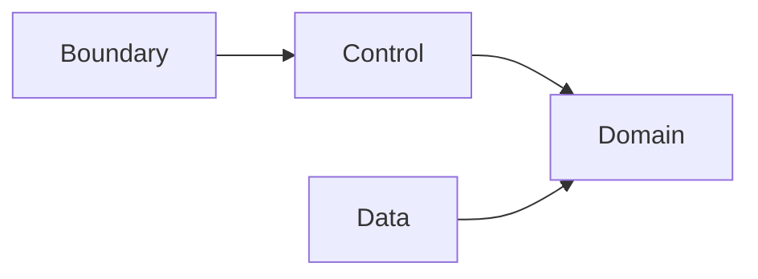

# UnitConverter_12 — 진행 보고서

| 항목 | 내용 |
|------|------|
| **문서 ID** | RPT-2026-05-20-01 |
| **작성 기준일** | 2026-05-20 |
| **대상 저장소** | UnitConverter_12 |
| **기준 문서** | [PRD v1.0](../docs/PRD.md) · [To-Do v1.0](../docs/TODO.md) |
| **보고 범위** | Phase 1~5 산출물 및 저장소 현황 (구현 코드 제외 중심) |

---

## 1. Executive Summary

본 프로젝트는 **길이 단위 변환 알고리즘 구현**이 아니라, **계약·테스트·BCE 레이어 분리**를 학습 목표로 하는 C++ 콘솔 실습이다.  
2026-05-20 기준 **문서·요구사항·설계·테스트 명세** 단계(M0)는 완료되었고, **CMake·Catch2·BCE 리팩터링 구현**(M1~M4)은 미착수 상태이다.

| 구분 | 상태 |
|------|------|
| 요구사항·계약 정의 | ✅ 완료 |
| 아키텍처·테스트 설계 | ✅ 완료 |
| PRD · To-Do · README | ✅ 완료 |
| Domain/Boundary/Data 구현 | ⬜ 미착수 |
| Catch2 테스트 코드 | ⬜ 미착수 |
| v1.0 인수 (AC-01~07) | ⬜ 미달 |

---

## 2. 프로젝트 목적 (PRD 1.1 정렬)

| 요소 | 내용 |
|------|------|
| **What** | meter 기준 길이 단위 변환 C++ 콘솔 학습 시스템 |
| **Who** | C++·클린 아키텍처·TDD 학습자 |
| **Why** | OCP/SRP·BCE·계약 우선 TDD로 확장 가능한 구조 체득 (6시간 실습) |

---

## 3. Phase별 산출물 요약

### Phase 1 — 문제 정의 (Problem Definition)

| 산출물 | 내용 | 저장 여부 |
|--------|------|-----------|
| 상황 관찰·Why 3단 | 관찰 관점 문제 정의, 수동 계산 vs 프로그램, 계약 선고정 동기 | 대화 산출 |
| Invariant 5건 | 기준 일관성·비율·입력 거부·완전 출력·확장 격리 | PRD·설계에 반영 |
| Mom Test 질문 10 | 학습자 행동·시간/리스크 연결 인터뷰 질문 | 대화 산출 |
| 위험 가정 3건 | 정확도≠고통, 확장성 체크리스트화, AI-계약 괴리 | 대화 산출 |

### Phase 2 — Dual-Track + BCE 설계

| 산출물 | 내용 | 저장 여부 |
|--------|------|-----------|
| Domain 설계 | Entity·Invariant·UseCase·API 시그니처·Domain TC | 대화 산출 → PRD 반영 |
| Boundary 설계 | 입출력·Error schema·계약 TC·에러 문구 고정 | PRD §3.3 |
| Data 설계 | JSON schema v1·File 추천·Data TC | PRD §5 |
| Integration | 의존 방향·E2E·커버리지·Traceability | PRD §4·§7 |

### Phase 3 — 테스트 명세 (RED)

| 산출물 | 내용 | 저장 여부 |
|--------|------|-----------|
| Catch2 RED 제목 36건 | 파싱·음수·미지원·비율·등록·table/json/csv | 대화 산출 → TODO 연계 |
| `.cursorrules` 뼈대 | 8키 YAML (값 비움) | ✅ `.cursorrules` |

### Phase 4 — 요구사항 패키지

| 산출물 | 내용 | 저장 여부 |
|--------|------|-----------|
| Epic / Journey / Story | 7 Story·AC·Gherkin 정합 | ✅ `docs/requirements.md` (초기 README 복제+확장 가능) |
| User Storyboard | Awareness→Outcome 5단계 | 대화 산출 |
| Gherkin 8 Scenario | Background·POL-NEG·POL-OUT·GH-1~8 | 대화 산출 → PRD 정합 |
| Level 5 체크리스트 | Epic~Gherkin 검증 표 | 대화 산출 → TODO 회귀 섹션 |

### Phase 5 — PRD · 운영 문서

| 산출물 | 경로 | 상태 |
|--------|------|------|
| PRD v1.0 | `docs/PRD.md` | ✅ 완료 (346행) |
| To-Do v1.0 | `docs/TODO.md` | ✅ 완료 |
| README | `README.md` | ✅ 완료 (389행) |
| 본 보고서 | `Report/Phase5_Progress_Report.md` | ✅ 신규 |

---

## 4. 저장소 현황 (2026-05-20)

### 4.1 파일 구조

```text
UnitConverter_12/
├── .cursorrules          # AI/프로젝트 규칙 뼈대 (8키, 값 비움)
├── UnitConverter.cpp     # 절차형 출발점 (리팩터링 전)
├── README.md             # 사용자·학습자용 메인 문서
├── docs/
│   ├── PRD.md            # 요구사항 정본
│   ├── TODO.md           # 작업·마일스톤·회귀 체크
│   └── requirements.md   # 초기 요구(README 유사)
└── Report/
    └── Phase5_Progress_Report.md
```

### 4.2 미존재 항목 (v1.0 To-Do 기준)

| 항목 | PRD 참조 | 비고 |
|------|----------|------|
| `CMakeLists.txt` | §4.1 | Must-Have |
| `tests/` Catch2 | §4.1, G-01 | Must-Have |
| `config/units.json` | §5.2 | Should-Have |
| `src/` BCE 분리 소스 | §4.2 | Must-Have |
| `LICENSE` | README | MIT 명시만, 파일 미추가 |
| CI 워크플로 | TODO Nice-to-Have | v2 후보 |

### 4.3 출발 코드 상태

`UnitConverter.cpp`는 **단일 파일 절차형** 구현으로, meter/feet/yard if-else 분기·하드코딩 비율·기본 table 출력만 제공한다. PRD가 요구하는 BCE·검증·설정·REGISTER·다중 포맷은 **미구현**이다. 기술 부채로 [TODO §기술 부채](../docs/TODO.md)에 등록되어 있다.

---

## 5. 확정된 계약 요약 (구현·테스트 기준선)

### 5.1 단위·비율 (meter 허브)

| unit | meters_per_unit |
|------|-----------------|
| meter | 1.0 |
| feet | 0.3048 |
| yard | 0.9144 |

### 5.2 입력·정책

| 정책 | 규칙 |
|------|------|
| CONVERT | `unit:value`, 양의 유한 value |
| POL-NEG | `value ≤ 0` 거부, `Value must be positive: {value}` |
| REGISTER | `REGISTER 1 {unit} = {k} meter` |
| 미지원 | `Unknown unit: {unit}`, stdout 변환 없음 |

### 5.3 출력

| 포맷 | 핵심 규칙 |
|------|-----------|
| table (기본) | `{src} {unit} = {tgt} {unit}`, target 1dp half-up |
| POL-OUT | source는 입력값·단위 그대로 |
| json / csv | PRD §6.3~6.4 필드 고정 (권장) |

### 5.4 인수·회귀 (v1.0 게이트)

| ID | 요약 |
|----|------|
| AC-01~07 | PRD §7.1 — 형식·환산·POL-OUT·REGISTER·config·커버리지·구조 |
| RR-01~05 | Golden trio·에러 스냅샷·비율 잠금·PRD 버전 연동 |

---

## 6. 마일스톤 진행 (TODO M0~M4)

| 마일스톤 | 포함 | 목표 | 상태 |
|----------|------|------|------|
| **M0** 문서·계약 | PRD, TODO, README, 본 보고서 | 2026-05-20 | ✅ **완료** |
| **M1** Domain GREEN | F-02, F-03, §5.1, G-01 | T+1일 (실습 ~2h) | 🔲 대기 |
| **M2** Boundary·table v1 | F-01, F-04, F-05, AC-01~03 | T+2일 | 🔲 대기 |
| **M3** 권장 기능 | F-06~F-08, AC-04~06 | T+3일 | 🔲 대기 |
| **M4** v1.0 릴리스 | Must 전항·회귀·README 실동기화 | T+4일 | 🔲 대기 |

---

## 7. To-Do 진행률 (요약)

| 구분 | 총 항목 | 완료 | 진행률 |
|------|---------|------|--------|
| 🔴 Must-Have | 13 | 0 | 0% |
| 🟡 Should-Have | 12 | 0 | 0% |
| 🟢 Nice-to-Have | 6 | 0 | 0% |
| 🔵 Tech Debt | 6 | 0 (인지·문서화만) | — |
| ✅ Done | 4 | 4 | 문서·베이스라인 |
| 📋 회귀 체크리스트 | 9 | 0 | 0% |

**Done 등록 항목**: PRD v1.0 · README · `.cursorrules` 뼈대 · 절차형 `UnitConverter.cpp` 베이스라인 · `docs/requirements.md` 존재.

---

## 8. 아키텍처 목표 (구현 전 합의)



- Domain은 Boundary/Data에 **의존하지 않음**.
- 신규 단위: `Catalog.add` / 설정 JSON.
- 신규 포맷: `Formatter` 추가만.

상세: [README §아키텍처](../README.md#아키텍처) · [PRD §4.2](../docs/PRD.md).

---

## 9. 리스크 및 이슈

| ID | 리스크 | 영향 | 완화 |
|----|--------|------|------|
| R-01 | CMake·테스트 골격 지연 | M1~M2 블로킹 | Must 첫 작업으로 M1 선행 |
| R-02 | AI 생성 코드 선행 → 계약 이탈 | 스냅샷·AC 대량 실패 | RED 36건·PRD §3.3 선행 |
| R-03 | table 1dp vs JSON 정밀도 혼선 | false bug | Formatter별 TC 분리 (PRD §6) |
| R-04 | PRD·Gherkin·README 3원천 불일치 | 인수 혼란 | RR-05 버전 bump 규칙 |
| R-05 | 실습 후 미재오픈 | 학습 효과 희석 | Golden trio·회고 증거 제출 |

---

## 10. 권장 다음 작업 (우선순위)

| 순서 | 작업 | 담당 | 완료 판정 |
|------|------|------|-----------|
| 1 | CMake + Catch2 + Domain 타깅 분리 | 학습자 | `ctest` Domain TC GREEN |
| 2 | Domain Catalog·Engine + DT-01·04·13 RED→GREEN | 학습자 | 커버리지 Domain ≥95% |
| 3 | Boundary 파서·POL-NEG·table + GH-1~8 | 학습자 | AC-01~03 스냅샷 diff 0 |
| 4 | Golden trio 등록 | 학습자 | RR-02 |
| 5 | config JSON + REGISTER (Should) | 학습자 | AC-04~05 |
| 6 | README 실제 빌드 경로와 동기화 | 학습자 | 회귀 체크 README 항목 ☑ |

---

## 11. 결론

UnitConverter_12는 **Phase 5 문서화 단계(M0)를 완료**하였다. PRD에 기능·비기능·데이터·출력·인수·회귀가 측정 가능한 문장으로 고정되었고, To-Do와 README가 이를 실행·학습 관점에서 연결한다.  
**v1.0 릴리스를 막는 요소**는 전부 구현·테스트 영역(M1~M4)이며, 다음 스프린트는 **Domain-first TDD**와 **계약 스냅샷**을 최우선으로 진행하는 것이 PRD·To-Do·본 보고서의 공통 권고이다.

---

## 12. 참고 문서

| 문서 | 용도 |
|------|------|
| [docs/PRD.md](../docs/PRD.md) | 요구사항·계약 정본 |
| [docs/TODO.md](../docs/TODO.md) | 작업·마일스톤·회귀 |
| [README.md](../README.md) | Quick Start·사용자 가이드 |
| [docs/requirements.md](../docs/requirements.md) | Phase 4 초기 요구 참고 |

---

## 문서 이력

| 버전 | 일자 | 작성 | 변경 |
|------|------|------|------|
| 1.0 | 2026-05-20 | Phase 5 종료 보고 | 최초 작성 |
