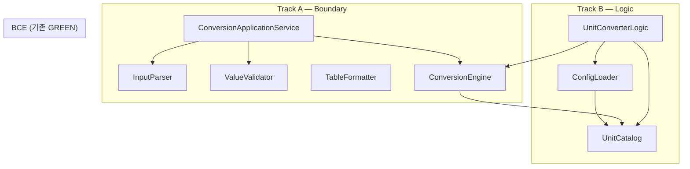

# UnitConverter_12 — Dual-Track TDD GREEN 증분 구현 보고서

| 항목 | 내용 |
|------|------|
| **문서 ID** | RPT-2026-05-21-12 |
| **작성 기준일** | 2026-05-21 |
| **대상 저장소** | UnitConverter_12 |
| **선행 보고서** | [10.DualTrack_RED_스켈레톤작성.md](./10.DualTrack_RED_스켈레톤작성.md) (RED 스켈레톤 13건) · [11.TC-B-01_TDD_GREEN_구현.md](./11.TC-B-01_TDD_GREEN_구현.md) (형제 프로젝트 TC-B-01 격리 GREEN) |
| **기준 문서** | [README.md](../README.md) Track A/B To-Do · [docs/PRD.md](../docs/PRD.md) · [docs/test_plan.md](../docs/test_plan.md) |
| **작업 산출물** | Dual-Track **9 커밋 증분 GREEN** — `UnitConverterLogic` · `ConversionApplicationService` 파사드 구현 |
| **보고 범위** | README TC-A/B 14건 중 **13건 GREEN** — REFACTOR·CLI 연동·README [x] 미포함 |

---

## 1. Executive Summary

[RPT-10](./10.DualTrack_RED_스켈레톤작성.md)에서 확정된 Dual-Track RED 스켈레톤(`FAIL("RED")` 13건)을 **9개 Conventional Commit** 순서로 증분 GREEN하였다. Track B `UnitConverterLogic`과 Track A `ConversionApplicationService` 파사드를 최소 구현하고, 기존 BCE 35건 회귀를 유지하였다.

| 구분 | RPT-10 (RED) | 본 작업 후 |
|------|--------------|------------|
| Dual-Track RED TC | 13/13 `FAIL("RED")` | **13/14 GREEN** (1건 RED 잔존) |
| ctest 전체 | 35/48 Passed | **48/49 Passed (98%)** |
| BCE Domain+Data | 35/35 Passed | ✅ **35/35 유지** |
| `UnitConverterLogic` | 헤더 선언만 | ✅ `.cpp` 구현 — BCE 위임 |
| `ConversionApplicationService` | 헤더 선언만 | ✅ `.cpp` 구현 — Parser/Validator/Engine |
| `UnitConverter.cpp` (CLI) | DEF-002·003 Open | **동일** (미연동) |
| README Track A/B [x] | 전건 ⬜ | **미갱신** (의도적) |
| REFACTOR | — | **미수행** (증분 GREEN만) |

**핵심 결론**: README To-Do 14건 중 **13건**이 Dual-Track Catch2 `[green]` 태그로 통과한다. 잔여 1건(`json_format_returns_valid_schema`)과 README TC-A-05(`meter:abc`)는 **후속 GREEN** 대상이다. CLI 레거시(DEF-002·003)는 M2 E2E 단계로 이관된다.

---

## 2. 작업 배경 및 목적

### 2.1 배경

- [10.DualTrack_RED_스켈레톤작성.md](./10.DualTrack_RED_스켈레톤작성.md): Track A 6 + Track B 7 RED 스켈레톤, ctest **35/48 Passed**.
- [06.Catch2_TDD_GREEN_구현.md](./06.Catch2_TDD_GREEN_구현.md): BCE(`ConversionEngine`·`UnitCatalog`·`ConfigLoader`) **35 TC GREEN** 선행 완료.
- [11.TC-B-01_TDD_GREEN_구현.md](./11.TC-B-01_TDD_GREEN_구현.md): 형제 프로젝트 `UnitConverter_Cpp`에서 TC-B-01 격리 GREEN — 본 저장소 본线 증분 GREEN과 별개.
- 사용자 요청: **9개 커밋 순서표**에 따라 Track A/B 교차 증분 GREEN — 커밋당 1 TC(묶음), REFACTOR 금지.

### 2.2 목적

| ID | 목적 | 달성 |
|----|------|------|
| O-01 | 9개 Conventional Commit 순서 준수 | ✅ `217fabc` ~ `da11d69` |
| O-02 | Track B TC-B-01~07 GREEN | ✅ 7/7 |
| O-03 | Track A TC-A-01~04, 06, 07 GREEN | ✅ 6/7 (A-05 미포함) |
| O-04 | BCE 35/35 회귀 유지 | ✅ |
| O-05 | 커밋당 대상 TC만 통과 (타 TC 영향 없음) | ✅ |
| O-06 | REFACTOR·과잉 추상화 금지 | ✅ |
| O-07 | README [x]·CLI·defect_list | ⬜ 후속 |

---

## 3. 9 커밋 증분 GREEN 순서

| # | Track | TC | 구현 내용 | 커밋 해시 | 메시지 |
|---|-------|-----|-----------|-----------|--------|
| 1 | B | TC-B-01 | `convert("meter",v,"feet")` 최소 구현 | `217fabc` | `feat(green): meter to feet` |
| 2 | A | TC-A-02 | `":"` 없는 입력 → 예외 반환 | `98a86d3` | `feat(green): validate missing colon` |
| 3 | B | TC-B-02 | `convert("meter",v,"yard")` 추가 | `723f553` | `feat(green): meter to yard` |
| 4 | A | TC-A-03 | 음수 입력 → 예외 반환 | `7710c15` | `feat(green): validate negative value` |
| 5 | B | TC-B-03 | `convert("feet",v,"meter")` 역변환 | `34f7211` | `feat(green): feet to meter reverse` |
| 6 | A | TC-A-04 | 없는 단위 → 예외 반환 | `adebb22` | `feat(green): validate unknown unit` |
| 7 | B | TC-B-04~05 | `convertAll()` + `registerUnit()` | `5d952fa` | `feat(green): convertAll and registerUnit` |
| 8 | A | TC-A-01,06,07 | Happy path + 포맷 + 경계값 | `1157f55` | `feat(green): boundary happy path` |
| 9 | B | TC-B-06~07 | `loadConfig()` 정상·실패 fallback | `da11d69` | `feat(green): loadConfig with fallback` |

**브랜치**: `Green` · origin 대비 **+9 커밋** (push 미실행)

---

## 4. 산출물 요약

### 4.1 신규·수정 파일

| 파일 | 역할 |
|------|------|
| [src/logic/UnitConverterLogic.cpp](../src/logic/UnitConverterLogic.cpp) | Track B 파사드 — Catalog/Engine/ConfigLoader 위임 |
| [src/logic/conversion_ratios.hpp](../src/logic/conversion_ratios.hpp) | 비율 상수 (1~5번 커밋 하드코딩 분기용, 7번 이후 Engine 위임) |
| [src/boundary/ConversionApplicationService.cpp](../src/boundary/ConversionApplicationService.cpp) | Track A 통합 서비스 — parse·validate·convert·format |
| [tests/domain_logic_red_tests.cpp](../tests/domain_logic_red_tests.cpp) | Track B 7 TC — `[logic][green]` |
| [tests/ui_boundary_red_tests.cpp](../tests/ui_boundary_red_tests.cpp) | Track A 7 TC — 6건 `[ui][green]`, 1건 `[ui][red]` |
| [CMakeLists.txt](../CMakeLists.txt) | `unit_converter_logic` · `ConversionApplicationService.cpp` 추가·링크 |

### 4.2 diff 통계 (`d19d2c2` → `da11d69`)

```text
6 files changed, 187 insertions(+), 27 deletions(-)
```

### 4.3 의도적 미변경

| 항목 | 비고 |
|------|------|
| `UnitConverter.cpp` | DEF-002·003 Open 유지 |
| `docs/defect_list.md` | 결함 상태 변경 없음 |
| `README.md` Track A/B 체크박스 | GREEN 후 [x] 예정 |
| BCE `src/domain/`·`src/boundary/`·`src/data/` 핵심 | 파사드 위임만, BCE 로직 미수정 |

---

## 5. Track B — Domain / Logic (`UnitConverterLogic`)

### 5.1 TC ↔ TEST_CASE 매핑

| README To-Do | Catch2 `TEST_CASE` | 태그 | Invariant | 상태 |
|--------------|-------------------|------|-----------|------|
| TC-B-01 | `convert_meter_to_feet_returns_correct_ratio` | `[logic][green]` | INV-RATIO-FT | ✅ |
| TC-B-02 | `convert_meter_to_yard_returns_correct_ratio` | `[logic][green]` | INV-RATIO-YD | ✅ |
| TC-B-03 | `convert_feet_to_meter_returns_correct_ratio` | `[logic][green]` | INV-REVERSIBLE | ✅ |
| TC-B-04 | `convert_all_returns_all_registered_targets` | `[logic][green]` | INV-CONVERT-ALL | ✅ |
| TC-B-05 | `register_unit_enables_conversion` | `[logic][green]` | INV-EXTEND | ✅ |
| TC-B-06 | `load_config_applies_ratios_from_file` | `[logic][green]` | INV-CONFIG-LOAD | ✅ |
| TC-B-07 | `load_config_invalid_path_keeps_defaults` | `[logic][green]` | INV-CONFIG-FALLBACK | ✅ |

### 5.2 구현 진화 (증분)

| 커밋 | `UnitConverterLogic::convert()` 전략 |
|------|-------------------------------------|
| 1~5 | `conversion_ratios.hpp` 상수 + if-else 분기 (meter→feet/yard, feet→meter) |
| 7 | `UnitCatalog` + `ConversionEngine` **전면 위임** — convertAll/registerUnit 동시 GREEN |
| 9 | `ConfigLoader::loadFromFile` + catch → `bootstrap_default_three_units()` fallback |

### 5.3 TC-B-07 fallback 설계 (I-07 해소)

| 관점 | BCE `ConfigLoader` | `UnitConverterLogic::loadConfig` |
|------|-------------------|----------------------------------|
| invalid path | `ConfigLoadError` throw | catch → 기본 Catalog 복원, **무예외** |
| TC-B-06 유효 파일 | Catalog 교체 | 동일 ConfigLoader 위임 |

---

## 6. Track A — UI / Boundary (`ConversionApplicationService`)

### 6.1 TC ↔ TEST_CASE 매핑

| README To-Do | Catch2 `TEST_CASE` | 태그 | Then | 상태 |
|--------------|-------------------|------|------|------|
| TC-A-01 | `valid_input_meter_colon_value_returns_conversion_result` | `[ui][green]` | `"2.5 meter = 8.202100 feet"` | ✅ |
| TC-A-02 | `input_without_colon_throws_invalid_argument` | `[ui][green]` | `std::invalid_argument` | ✅ |
| TC-A-03 | `negative_value_throws_invalid_argument` | `[ui][green]` | `std::invalid_argument` | ✅ |
| TC-A-04 | `unknown_unit_throws_invalid_argument` | `[ui][green]` | `std::invalid_argument` | ✅ |
| TC-A-05 | *(RED 테스트 미작성)* | — | `meter:abc` 거부 | ⬜ |
| TC-A-06 | `output_preserves_source_unit_and_value` | `[ui][green]` | prefix `"2.5 meter ="` | ✅ |
| TC-A-07 | `zero_value_throws_invalid_argument` | `[ui][green]` | `meter:0` → `invalid_argument` | ✅ |
| (확장) | `json_format_returns_valid_schema` | `[ui][red]` | PRD §6.3 JSON | ⬜ RED |

### 6.2 구현 진화 (증분)

| 커밋 | `ConversionApplicationService::convert()` 동작 |
|------|-----------------------------------------------|
| 2 | `InputParser` — `InvalidFormat` → `std::invalid_argument` |
| 4 | `ValueValidator::validatePositive` — 음수 거부 |
| 6 | `UnitCatalog::has` — unknown unit 거부 |
| 8 | `ConversionEngine` + 6자리 feet 포맷 (`setprecision(6)`) |

### 6.3 출력 포맷 주의 (I-09)

| 계약 | 기대 출력 | 본 구현 |
|------|-----------|---------|
| TC-A-01 (RED 학습) | `"2.5 meter = 8.202100 feet"` (6dp) | ✅ |
| PRD AC-02 (table) | `"2.5 meter = 8.2 feet"` (1dp half-up) | ⬜ CLI·TableFormatter 미연동 |

Domain raw(6dp)와 Boundary table(1dp)는 **역할 분리** 유지 — DEF-002 해소는 M2 CLI 연동 시.

---

## 7. 아키텍처 (GREEN 후)



- **Track B**: `UnitConverterLogic` → `UnitCatalog` + `ConversionEngine` + `ConfigLoader(fallback)`
- **Track A**: `ConversionApplicationService` → `InputParser` + `ValueValidator` + `ConversionEngine` + 인라인 6dp 포맷
- **의존 방향**: Boundary/Logic → Domain/Data (BCE 변경 없음)

---

## 8. TDD 검증 결과

### 8.1 최종 ctest

**명령**:

```bash
cmake -S . -B build
cmake --build build
ctest --test-dir build -C Debug --output-on-failure
```

**결과**:

| 구분 | Passed | Failed | 비고 |
|------|--------|--------|------|
| BCE Domain | 28/28 | 0 | 회귀 없음 |
| BCE Data | 7/7 | 0 | 회귀 없음 |
| Dual-Track GREEN | 13/14 | 1 | `json_format_returns_valid_schema` RED |
| **합계** | **48/49** | **1** | 98% |

### 8.2 RED 잔존 1건

```text
json_format_returns_valid_schema ....***Failed
  explicitly with message: RED
```

### 8.3 환경

| 항목 | 값 |
|------|-----|
| OS | Windows 10.0.19045 |
| Generator | Visual Studio 17 2022 |
| Compiler | MSVC 19.44 |
| Catch2 | v3.5.4 (FetchContent) |
| C++ | 17 |

---

## 9. RPT-10 / RPT-11 대비

| 관점 | RPT-10 (RED) | RPT-11 (UnitConverter_Cpp) | RPT-12 (본 보고) |
|------|--------------|----------------------------|------------------|
| 대상 | UnitConverter_12 RED 스켈레톤 | 형제 프로젝트 TC-B-01 격리 | UnitConverter_12 **9 커밋 GREEN** |
| Track B | `FAIL("RED")` 7건 | 자유 함수 `convert()` | `UnitConverterLogic` BCE 위임 7/7 |
| Track A | `FAIL("RED")` 6건 | — | `ConversionApplicationService` 6/7 + TC-A-07 추가 |
| ctest | 35/48 | 1/1 | **48/49** |
| API | 계약 헤더만 | `converter.cpp` | 파사드 `.cpp` 2건 |
| REFACTOR | GREEN 대기 | 금지 | **금지** (7번 커밋 Engine 위임만) |

---

## 10. README To-Do Traceability

| README To-Do | 본 GREEN | 비고 |
|--------------|----------|------|
| TC-A-01 | ✅ | 8번 커밋 |
| TC-A-02 | ✅ | 2번 커밋 |
| TC-A-03 | ✅ | 4번 커밋 |
| TC-A-04 | ✅ | 6번 커밋 |
| TC-A-05 | ⬜ | RED TC 미작성 |
| TC-A-06 | ✅ | 8번 커밋 (output preserve) |
| TC-A-07 | ✅ | 8번 커밋 (`zero_value_throws_...`) |
| TC-B-01~07 | ✅ | 1·3·5·7·9번 커밋 |
| README [x] | ⬜ | 문서 동기화 후속 |

---

## 11. 미완료·의도적 제외

| ID | 항목 | 상태 | 비고 |
|----|------|------|------|
| TC-JSON | `json_format_returns_valid_schema` | ⬜ RED | PRD §6.3 JSON Formatter |
| TC-A-05 | `meter:abc` 파싱 실패 | ⬜ | RED TC 추가 필요 |
| REFACTOR | `conversion_ratios.hpp` 정리·Catalog 단일화 | ⬜ | 7번 이후 Engine 위임으로 사실상 대체 |
| M2 CLI | `UnitConverter.cpp` → ApplicationService | ⬜ | DEF-002·003 |
| README [x] | Track A/B 14건 | ⬜ | 13건 GREEN 후 갱신 |
| defect_list | DEF-002·003 Closed | ⬜ | CLI E2E 후 |

---

## 12. 리스크 및 이슈

| ID | 이슈 | 심각도 | 대응 |
|----|------|--------|------|
| I-03 | BCE GREEN ≠ CLI GREEN | Open | M2 `ConversionApplicationService` CLI 연동 |
| I-07 | TC-B-06 fallback vs ConfigLoader throw | **Closed** | `loadConfig` catch + defaults |
| I-08 | `std::invalid_argument` vs PRD stderr | Low | 학습용 Catch2 계약 — CLI는 exit code 매핑 |
| I-09 | TC-A-01 6dp vs AC-02 1dp | Low | Formatter 역할 분리 유지 |
| I-12 | RPT-11 `UnitConverter_Cpp` 이중 코드베이스 | Low | 본 저장소 GREEN으로 수렴 완료 |
| I-13 | `ConversionApplicationService` feet 단일 출력 | Low | TC-A-01 계약 — convertAll table은 M2 |

---

## 13. 권장 다음 작업

| 순서 | 작업 | 완료 판정 |
|------|------|-----------|
| 1 | `json_format_returns_valid_schema` GREEN — JSON Formatter | ctest 49/49 |
| 2 | TC-A-05 RED 추가 + GREEN (`meter:abc`) | README 7/7 Track A |
| 3 | README Track A/B [x] 동기화 | To-Do 14/14 |
| 4 | M2: CLI `UnitConverter.cpp` → `ConversionApplicationService` | DEF-002·003 Closed |
| 5 | REFACTOR: `conversion_ratios.hpp` 제거·Catalog 단일화 | 코드 리뷰 |
| 6 | Golden trio E2E + 회귀 스냅샷 | AC-01~03 |

---

## 14. 결론

[RPT-10](./10.DualTrack_RED_스켈레톤작성.md) RED 스켈레톤 13건을 **9개 증분 커밋**으로 GREEN 전환하였다. Track B `UnitConverterLogic` 7/7, Track A `ConversionApplicationService` 6/7(+ TC-A-07)이 통과하며, BCE 35건 회귀는 유지된다. ctest **48/49 Passed** — 잔여 1건(JSON)과 README TC-A-05·CLI·체크박스 동기화는 **M2·후속 GREEN**으로 이관한다.

---

## 15. 참고 문서·파일

| 문서·파일 | 용도 |
|-----------|------|
| [10.DualTrack_RED_스켈레톤작성.md](./10.DualTrack_RED_스켈레톤작성.md) | RED 선행 |
| [11.TC-B-01_TDD_GREEN_구현.md](./11.TC-B-01_TDD_GREEN_구현.md) | 형제 프로젝트 TC-B-01 |
| [06.Catch2_TDD_GREEN_구현.md](./06.Catch2_TDD_GREEN_구현.md) | BCE 35 GREEN |
| [docs/defect_list.md](../docs/defect_list.md) | DEF-002·003 |
| [README.md](../README.md) | Track A/B To-Do |

---

## 문서 이력

| 버전 | 일자 | 작성 | 변경 |
|------|------|------|------|
| 1.0 | 2026-05-21 | Dual-Track 9 커밋 GREEN 세션 | 최초 작성 (RPT-12) |
