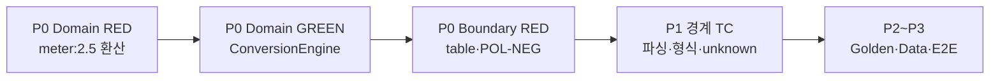

# UnitConverter_12 — 테스트 계획서

| 항목 | 내용 |
|------|------|
| **문서 ID** | TP-2026-05-21-01 |
| **작성 기준일** | 2026-05-21 |
| **대상 저장소** | UnitConverter_12 |
| **기준 문서** | [PRD v1.0](./PRD.md) · [requirements.md](./requirements.md) · [README.md](../README.md) |
| **선행 보고서** | [03.TestPlan_샘플예제_선정.md](../Report/03.TestPlan_샘플예제_선정.md) |
| **기술 스택** | C++17 · CMake · Catch2 v2 또는 v3 |
| **샘플 앵커** | `meter:2.5` CONVERT — meter → feet/yard (table 1dp) |

---

## 1. Executive Summary

본 테스트 계획서는 선정된 샘플 예제 **`meter:2.5` CONVERT(table)** 를 중심으로, Catch2 기반 **Domain / Boundary / Data / 통합** 4타깅 테스트 범위·우선순위·경계값·커버리지 측정 전략을 정의한다.

| 구분 | 요약 |
|------|------|
| **앵커 기능** | meter 기준 길이 변환 — feet·yard table 출력 |
| **Golden 입력** | `meter:2.5` |
| **Golden 출력** | `2.5 meter = 8.2 feet`, `2.5 meter = 2.7 yard` (1dp half-up, exit 0) |
| **근거** | requirements 기본 1·4, PRD AC-02, Background 규칙 1·2 |
| **현재 상태** | 레거시 `UnitConverter.cpp` 단일 파일 — BCE·Catch2·CMake **미착수** (RED FAIL 정상) |
| **커버리지 목표** | Domain Line ≥95% / Branch ≥90% · Boundary Line ≥90% / Branch ≥85% |

**핵심 원칙**: PRD·README **계약**을 테스트 정본으로 삼고, 레거시 실행 결과와의 차이는 **의도적 FAIL**로 관리한다.

---

## 2. 테스트 앵커 — meter → feet 변환

### 2.1 기능 정의

| 항목 | 내용 |
|------|------|
| **기능명** | meter 기준 CONVERT — table 출력 (meter → feet/yard) |
| **입력 형식** | `{unit}:{value}` — `unit`=`[A-Za-z][A-Za-z0-9_]*`, `value`=양의 유한 십진 |
| **입력 예시** | `meter:2.5` |
| **비즈니스 규칙** | `1 meter = 3.28084 feet`, `1 meter = 1.09361 yard` (meter 허브) |
| **환산식** | `target = source × (k_source / k_target)`, `k`=`meters_per_unit` |

### 2.2 기대 결과 (PRD 계약)

| 레이어 | 검증 대상 | 기대 |
|--------|-----------|------|
| **Domain (raw)** | feet 환산 | `2.5 × 3.28084 = 8.2021` — 허용오차 `|a−e| ≤ max(1e−9, |e|×1e−9)` |
| **Domain (raw)** | yard 환산 | `2.5 × 1.09361 = 2.734025` |
| **Boundary (table)** | stdout 2줄 | `2.5 meter = 8.2 feet`, `2.5 meter = 2.7 yard` |
| **Boundary (table)** | exit / stderr | exit `0`, stderr 빈 |

### 2.3 수치 근거

```
feet  = 2.5 × 3.28084  = 8.2021   → half-up 1dp → 8.2
yard  = 2.5 × 1.09361  = 2.734025 → half-up 1dp → 2.7
```

### 2.4 레거시 갭 (참고)

| 항목 | PRD 목표 | `UnitConverter.cpp` 현재 |
|------|----------|--------------------------|
| table 1dp | `8.2 feet`, `2.7 yard` | 전체 정밀도 출력 |
| POL-NEG | `value ≤ 0` 거부 | 검증 없음 |
| stderr | `Value must be positive: {value}` | 미구현 |
| 아키텍처 | BCE 분리 | 단일 `main` 분기 |

→ 본 계획의 TC는 **목표 계약** 기준이며, 레거시 대비 diff는 RED 단계에서 FAIL로 기록한다.

---

## 3. Catch2 단위 테스트 범위 및 우선순위

### 3.1 타깅 구조 (CMake 4타깅)

| 타깅 | 바이너리 (예) | Catch2 태그 | 의존 |
|------|---------------|-------------|------|
| Domain | `unit_converter_domain_tests` | `[domain]` | Domain 소스만 |
| Boundary | `unit_converter_boundary_tests` | `[boundary]` | Boundary + Mock Domain |
| Data | `unit_converter_data_tests` | `[data]` | Config Source + Domain |
| 통합 | `unit_converter_integration_tests` | `[integration]` | 전체 E2E |

**제약**: Domain 타깅은 Boundary/Data를 **link/include 하지 않음** (PRD §4.2, AC-07).

### 3.2 우선순위 매트릭스

| 우선순위 | ID | 범위 | Catch2 TC (예시 제목) | 태그 | 마일스톤 | PRD 근거 |
|----------|-----|------|----------------------|------|----------|----------|
| **P0** | TP-D-01 | Domain 환산 | `meter 2.5 converts to feet 8.2 at 1dp` | `[domain][red]` | M1 | AC-02, §5.1 |
| **P0** | TP-D-02 | Domain 환산 | `meter 2.5 converts to yard 2.7 at 1dp` | `[domain][red]` | M1 | AC-02, §5.1 |
| **P0** | TP-D-03 | Catalog k 상수 | `default catalog k_feet equals 1/3.28084` | `[domain]` | M1 | §5.1 검증 |
| **P0** | TP-B-01 | Boundary E2E | `meter:2.5 table stdout golden snapshot` | `[boundary][red]` | M2 | AC-02, GH-1 |
| **P0** | TP-B-02 | POL-NEG | `meter:-2.5 rejected before conversion` | `[boundary][red]` | M2 | POL-NEG-02~03 |
| **P0** | TP-B-03 | POL-NEG | `meter:0 rejected with positive value message` | `[boundary][red]` | M2 | POL-NEG-01 |
| **P1** | TP-B-04 | 파싱 | `meter:abc invalid number exit 1` | `[boundary]` | M2 | IN-03, AC-01 |
| **P1** | TP-B-05 | 형식 | `meter2.5 missing colon invalid format` | `[boundary]` | M2 | IN-01, AC-01 |
| **P1** | TP-B-06 | 미지원 단위 | `parsec:1.0 unknown unit no stdout` | `[boundary]` | M2 | GH-8, AC-01 |
| **P1** | TP-D-04 | 역방향 | `feet 8.2 converts to meter within tolerance` | `[domain]` | M1 | §5.1, AC-03 |
| **P1** | TP-D-05 | 허브 일관 | `feet to yard equals meter hub path` | `[domain]` | M1 | NG-03 |
| **P2** | TP-D-06 | 경계 Domain | `LengthQuantity rejects zero and negative` | `[domain]` | M1 | POL-NEG Domain |
| **P2** | TP-B-07 | 대형 value | `meter:1e308 rejected or finite guard` | `[boundary]` | M2 | §4.3, 오버플로 |
| **P2** | TP-B-08 | POL-OUT | `feet:8.2 all lines prefix 8.2 feet` | `[boundary]` | M2 | AC-03, GH-2 |
| **P3** | TP-D-07 | Golden trio | `meter 1.0 / 2.5 / 0.1 table snapshots` | `[domain][integration]` | M2+ | RR-02 |
| **P3** | TP-D-08 | Data | `config load populates catalog` | `[data]` | M3 | F-06, AC-05 |
| **P3** | TP-I-01 | REGISTER | `REGISTER cubit then cubit:2 converts` | `[integration]` | M3 | AC-04 |

### 3.3 RED → GREEN 실행 순서



1. **M1 Domain RED**: TP-D-01~03 — `ctest` **FAIL** 확인 (구현 없음).
2. **M1 Domain GREEN**: `ConversionEngine`·`UnitCatalog` 최소 구현 → TP-D-01~05 GREEN.
3. **M2 Boundary RED/GREEN**: 파서·Formatter·검증 → TP-B-01~08 GREEN, AC-01~03 충족.
4. **M3+**: Data·REGISTER·포맷 확장.

### 3.4 Catch2 태깅·필터

```bash
# Domain만
ctest --test-dir build -R domain

# RED TC만 (의도적 FAIL 확인)
./build/unit_converter_domain_tests "[domain][red]"

# Boundary 계약
./build/unit_converter_boundary_tests "[boundary]"
```

---

## 4. 경계값 케이스 목록

앵커 `meter:2.5`와 동일 CONVERT 흐름에서 확장하는 **필수 경계값** TC이다.

### 4.1 요약 표

| ID | 입력 | 분류 | 기대 (PRD 계약) | Catch2 TC ID | 우선순위 |
|----|------|------|-----------------|--------------|----------|
| **BV-01** | `meter:0` | 영값 (POL-NEG) | exit `1`, stderr `Value must be positive: 0`, stdout 변환 없음, Domain 미호출 | TP-B-03 | P0 |
| **BV-02** | `meter:1e308` (또는 `1e100`) | 매우 큰 수 | (A) POL-NEG/파서 거부 **또는** (B) 유한 결과 내 정상 환산 — **프로젝트는 (B) + double 범위 내 허용오차** 채택 권장; `Inf`/`NaN` 입력 시 exit `1` | TP-B-07 | P2 |
| **BV-03** | `meter:-2.5` | 음수 (POL-NEG) | exit `1`, stderr `Value must be positive: -2.5`, ConversionEngine 호출 0회 | TP-B-02 | P0 |
| **BV-04** | `meter:abc` | 소수점 파싱 실패 | exit `1`, stderr `Invalid number: abc`, stdout 변환 없음 | TP-B-04 | P1 |
| **BV-05** | `meter2.5` | `:` 없음 (형식 오류) | exit `1`, stderr `Invalid format. Use unit:value (ex: meter:2.5)` | TP-B-05 | P1 |
| **BV-06** | `parsec:1.0` | 없는 단위 | exit `1`, stderr `Unknown unit: parsec`, stdout·부분 줄 없음 | TP-B-06 | P1 |

### 4.2 케이스별 상세 (Given-When-Then)

#### BV-01 — value = 0 (영값 변환)

| 항목 | 내용 |
|------|------|
| **Given** | 기본 Catalog (meter, feet, yard) |
| **When** | stdin `meter:0` |
| **Then** | exit `1`; stderr 정확히 `Value must be positive: 0`; stdout 빈; Mock `ConversionEngine::convert` 호출 **0회** |
| **레거시 갭** | `UnitConverter.cpp`는 0을 허용·변환함 → **FAIL** |

#### BV-02 — value = 매우 큰 수 (오버플로 위험)

| 항목 | 내용 |
|------|------|
| **Given** | double 유한 범위 내 최대 근사값 |
| **When** | `meter:1e100` 또는 `meter:1e308` |
| **Then (권장)** | 파싱 성공 시 `feet = value × 3.28084` within §4.3 오차; `Inf`/`NaN` 발생 시 Boundary에서 거부 |
| **Domain TC** | `ConversionEngine::convert("meter", 1e100)` — 결과가 `Inf`/`NaN`이 아님을 `REQUIRE(std::isfinite(...))` |
| **Boundary TC** | E2E stdout에 `Inf`/`NaN` 문자열 **없음** |
| **비고** | 레거시는 double 그대로 출력 — 오버플로 시 `inf` 가능 → 계약 TC로 방지 |

#### BV-03 — value < 0 (음수 입력 정책)

| 항목 | 내용 |
|------|------|
| **When** | `meter:-2.5`, `feet:-1`, `yard:-0.001` |
| **Then** | POL-NEG-03: stderr `Value must be positive: {value}` (입력 value 문자열 그대로 치환), exit `1` |
| **Catch2 예시** | README RED 스니펫 — `meter:-2.5 rejected before conversion` |

#### BV-04 — 소수점 파싱 실패 (`meter:abc`)

| 항목 | 내용 |
|------|------|
| **When** | `meter:abc`, `meter:2.5.3`, `meter:` (빈 value) |
| **Then** | exit `1`, stderr `Invalid number: {token}` — `{token}`은 콜론 뒤 토큰 |
| **Domain** | 파싱 실패 시 Domain **진입 전** 거부 (IN-03) |

#### BV-05 — `:` 없는 입력 (형식 오류)

| 항목 | 내용 |
|------|------|
| **When** | `meter2.5`, `:2.5`, `meter`, 빈 줄 |
| **Then** | exit `1`, stderr `Invalid format. Use unit:value (ex: meter:2.5)` |
| **레거시** | `UnitConverter.cpp` L15~17 — 동일 메시지 **부분 일치** (GREEN 후 스냅샷 고정) |

#### BV-06 — 없는 단위 (`parsec:1.0`)

| 항목 | 내용 |
|------|------|
| **When** | `parsec:1.0`, `stone:2.5` |
| **Then** | exit `1`, stderr `Unknown unit: parsec`; stdout에 `{value} parsec =` 형태 **부분 줄 금지** (GH-8) |
| **레거시** | L39 — 메시지 유사하나 PRD는 stdout 완전 차단 요구 |

### 4.3 앵커 정상 경로 (Happy Path)

| ID | 입력 | 기대 |
|----|------|------|
| **HP-01** | `meter:2.5` | table 2줄 `8.2 feet` / `2.7 yard`, exit 0 |
| **HP-02** | `meter:1.0` | `1.0 meter = 3.3 feet`, `1.0 meter = 1.1 yard` (Golden trio) |
| **HP-03** | `meter:0.1` | Golden trio 3번째 스냅샷 (RR-02) |

---

## 5. 예외·특이 케이스 목록

PRD §3.3·§7.1 및 앵커 기능 주변 **비정상·특수 입력** TC이다.

### 5.1 입력·파싱 예외

| ID | 입력/조건 | error_code | exit | stderr 패턴 | Domain 호출 |
|----|-----------|------------|------|-------------|---------------|
| **EX-01** | `meter:` (빈 value) | INVALID_NUMBER | 1 | `Invalid number:` | 0 |
| **EX-02** | `:2.5` (빈 unit) | INVALID_FORMAT | 1 | `Invalid format.` | 0 |
| **EX-03** | `meter:NaN` / `meter:inf` | NEGATIVE_VALUE 또는 INVALID_NUMBER | 1 | POL-NEG 또는 Invalid number | 0 |
| **EX-04** | `meter: 2.5` (공백 포함) | INVALID_NUMBER | 1 | `Invalid number:  2.5` (토큰 그대로) | 0 |
| **EX-05** | `meter:+2.5` | (성공) | 0 | — | 1 |
| **EX-06** | `METER:2.5` | UNKNOWN_UNIT | 1 | `Unknown unit: METER` (대소문자 구분) | 0 |

### 5.2 POL-NEG·Domain 불변식

| ID | 조건 | 기대 |
|----|------|------|
| **EX-07** | `LengthQuantity::create(-1.0)` | Domain 예외 또는 `expected` 실패 |
| **EX-08** | `LengthQuantity::create(0.0)` | 동일 |
| **EX-09** | `MetersPerUnit::create(0)` | Catalog 등록 거부 |
| **EX-10** | Boundary에서 POL-NEG 거부 후 | **stderr 1줄만**, exit 1 (중복 메시지 금지) |

### 5.3 출력·POL-OUT 특이

| ID | 조건 | 기대 |
|----|------|------|
| **EX-11** | `meter:2.50` 입력 | stdout source `2.50` 유지 (POL-OUT-03, `2.5`로 강제 변환 금지) |
| **EX-12** | `feet:8.2` | 모든 줄 prefix `8.2 feet =` (AC-03) |
| **EX-13** | 성공 시 stderr | **완전히 빈** (공백·개행만도 FAIL) |

### 5.4 아키텍처·Mock 특이

| ID | 조건 | 기대 |
|----|------|------|
| **EX-14** | Boundary TC + Mock Engine | 파싱 실패·POL-NEG·unknown unit 시 `convert()` **0회** |
| **EX-15** | feet↔yard 직접 비율 하드코딩 | **테스트로 금지** — meter 경유만 허용 (NG-03) |
| **EX-16** | CONFIG_LOAD_FAILED | exit `2`, `Failed to load config: {path}`, 변환 0회 (AC-05) |

### 5.5 Catch2 구현 패턴 (Boundary Mock)

```cpp
TEST_CASE("parsec:1.0 unknown unit no partial stdout", "[boundary]") {
    MockConversionEngine engine;
    REQUIRE(engine.convert_call_count == 0);

    auto result = run_cli("parsec:1.0");

    REQUIRE(result.exit_code == 1);
    REQUIRE(result.stderr_str == "Unknown unit: parsec\n");
    REQUIRE(result.stdout_str.empty());
    REQUIRE(engine.convert_call_count == 0);
}
```

---

## 6. 커버리지 목표

### 6.1 레이어별 임계값 (PRD §4.3)

| 레이어 | Line | Branch | 본 계획 핵심 |
|--------|------|--------|--------------|
| **Domain** | **≥ 95%** | **≥ 90%** | `UnitCatalog`, `ConversionEngine`, `LengthQuantity`, k 상수 |
| **Boundary** | **≥ 90%** | **≥ 85%** | Parser, POL-NEG, Formatter, stderr/exit |
| Data | ≥ 85% | ≥ 80% | JSON/YAML Config Source (M3) |
| Control | ≥ 80% | ≥ 75% | Application orchestration |
| **전체** | **≥ 88%** | — | 4타깅 합산 |

> 요청 기준 **Domain 95%+ / Boundary 85%+** 는 위 표의 **Domain Line·Boundary Branch** 임계값과 정합한다.

### 6.2 앵커 기능별 커버리지 매핑

| 소스 (목표 BCE) | 커버하는 TC | 목표 Line |
|-----------------|-------------|-----------|
| `ConversionEngine.cpp` | TP-D-01~02, TP-D-04~05 | ≥ 95% |
| `UnitCatalog.cpp` | TP-D-03, TP-B-06 | ≥ 95% |
| `InputParser.cpp` | TP-B-04~05, BV-04~05 | ≥ 90% |
| `ValueValidator.cpp` | TP-B-02~03, BV-01~03 | ≥ 90% |
| `TableFormatter.cpp` | TP-B-01, TP-B-08 | ≥ 90% |

### 6.3 게이트·인수 (AC-06)

- GREEN 마일스톤 완료 시 **lcov HTML 리포트** 제출.
- Domain·Boundary 임계값 **미달 시 PR merge 불가** (CI 연동 시 `genhtml` 후 스크립트 게이트).
- Golden trio 스냅샷 diff `0` (RR-02) — 커버리지와 **별도** 회귀 게이트.

---

## 7. gcov / lcov / UnitConverter.cpp 커버리지 측정 전략

현재는 레거시 `UnitConverter.cpp` 단일 파일이나, M1 이후 BCE `src/`로 이전한다. **전환 전·후** 측정 방법을 모두 기술한다.

### 7.1 빌드 플래그 (CMake)

```cmake
# CMakeLists.txt (목표)
option(ENABLE_COVERAGE "Build with coverage" OFF)

if(ENABLE_COVERAGE)
  if(CMAKE_CXX_COMPILER_ID MATCHES "GNU|Clang")
    add_compile_options(--coverage -O0 -g)
    add_link_options(--coverage)
  endif()
endif()
```

```bash
cmake -S . -B build -DCMAKE_BUILD_TYPE=Debug -DENABLE_COVERAGE=ON
cmake --build build
ctest --test-dir build --output-on-failure
```

### 7.2 gcov — 객체 파일 단위 측정

| 단계 | 명령 | 설명 |
|------|------|------|
| 1 | `ctest --test-dir build` | `.gcda` 생성 (테스트 실행) |
| 2 | `gcov -b -c build/CMakeFiles/unit_converter_domain_tests.dir/src/domain/ConversionEngine.cpp.gcda` | Line·Branch 카운트 |
| 3 | `gcov UnitConverter.cpp` | **레거시 단계**: 단일 파일 Line % 확인 |

**레거시 `UnitConverter.cpp` 한정 측정** (BCE 이전):

```bash
g++ --coverage -O0 -g -o UnitConverter_cov UnitConverter.cpp
echo "meter:2.5" | ./UnitConverter_cov
gcov -b UnitConverter.cpp
# → UnitConverter.cpp.gcov 생성, 실행된 분기 확인
```

| gcov 지표 | 목표 (레거시) | 비고 |
|-----------|---------------|------|
| Line | 참고용 | E2E 1건만으로는 **낮음** — Catch2 도입 후 재측정 |
| Branch | `if (unit == "meter")` 등 3분기 + 파싱 분기 | BV TC로 85%+ 목표 |

### 7.3 lcov — 레이어·파일 집계

```bash
# 초기화 (이전 실행 데이터 제거)
lcov --directory build --zerocounters

# 테스트 실행
ctest --test-dir build --output-on-failure

# 캡처 (--ignore-errors gcov for CI 호환)
lcov --capture --directory build --output-file build/coverage.info \
  --ignore-errors gcov

# 테스트·Catch2·main 제외 (Domain 순수 로직만)
lcov --remove build/coverage.info \
  '*/tests/*' '*/catch2/*' '*/build/*' \
  --output-file build/coverage.filtered.info

# HTML 리포트
genhtml build/coverage.filtered.info --output-directory build/coverage_html
```

### 7.4 타깅별 lcov 스코프

| 측정 대상 | lcov `--extract` 패턴 | Line 목표 |
|-----------|------------------------|-----------|
| **Domain only** | `*/src/domain/*` | ≥ 95% |
| **Boundary only** | `*/src/boundary/*` | ≥ 90% |
| **UnitConverter.cpp (레거시)** | `UnitConverter.cpp` | 전환 전 baseline; **≥ 88%** 후 `src/` 이전 |
| **전체** | `*/src/*` | ≥ 88% |

```bash
# Domain 95% 게이트 예시 (bash)
lcov --extract build/coverage.info '*/src/domain/*' -o build/domain.info
lcov --summary build/domain.info
# Line coverage >= 95.0% 확인
```

### 7.5 앵커 TC와 gcov 매핑

| TC | 실행 경로 | `UnitConverter.cpp` (레거시) | BCE (목표) |
|----|-----------|------------------------------|------------|
| TP-D-01 `meter:2.5 → feet` | Domain unit test | L32~33, L44 (간접) | `ConversionEngine.cpp` |
| TP-B-01 table E2E | integration | L47~49 전체 | Parser + Formatter + Engine |
| BV-03 `meter:-2.5` | boundary | L23~28 (stod만) — **POL-NEG 분기 미커버** | `ValueValidator.cpp` |
| BV-05 형식 오류 | boundary | L15~17 ✅ | `InputParser.cpp` |
| BV-06 unknown unit | boundary | L38~40 ✅ | `UnitCatalog` lookup |

**RED 단계 기대**: POL-NEG·1dp 미구현 분기는 gcov에서 **미커버** → GREEN 후 동일 TC 재실행하여 커버리지 **상승 확인**.

### 7.6 CI·로컬 워크플로 (권장)

```text
configure (ENABLE_COVERAGE=ON)
  → build
  → ctest (4타깅)
  → lcov capture
  → filter (tests/catch2 제외)
  → per-layer extract (domain / boundary)
  → threshold script (Domain Line ≥95, Boundary Branch ≥85)
  → genhtml artifact upload
```

### 7.7 Windows (MSVC) 참고

- **GCC/Clang (MinGW/WSL)**: 위 gcov/lcov 절차 그대로 적용.
- **MSVC**: `gcov` 미지원 → **OpenCppCoverage** 또는 WSL 빌드로 lcov 측정 (PRD §4.1: g++ 호환 환경).

---

## 8. Traceability (C2C)

| 계층 | ID | 본 문서 절 |
|------|-----|------------|
| 요구 | requirements 기본 1·4 | §2, §4.3 HP |
| PRD | AC-02, AC-01, POL-NEG, §4.3 | §2.2, §4, §6 |
| 샘플 선정 | RPT-03 §4.2 | §2 |
| Catch2 RED | README 스니펫 | §3.2 P0 |
| 커버리지 | AC-06, G-01 | §6, §7 |
| 구현 | `UnitConverter.cpp` (레거시) | §2.4, §7.5 |

---

## 9. 리스크 및 완화

| ID | 리스크 | 완화 |
|----|--------|------|
| R-01 | 레거시 고정밀 출력을 Golden과 혼동 | Domain(raw) vs Boundary(1dp) TC **분리** (§2.2) |
| R-02 | `UnitConverter.cpp` gcov만으로 95% 착각 | BCE `src/domain/*` lcov를 **정식 게이트**로 지정 (§7.4) |
| R-03 | BV-02 대형 수 `Inf` 출력 | `std::isfinite` Domain·Boundary 이중 검증 |
| R-04 | Boundary Mock 누락으로 Domain 오호출 | EX-14, TP-B-02~06에서 call count 0 assert |
| R-05 | feet↔yard 직접 TC | NG-03 — meter 경유 TC만 허용 (TP-D-05) |

---

## 10. 권장 다음 작업

| 순서 | 작업 | 완료 판정 |
|------|------|-----------|
| 1 | CMake + Catch2 4타깅 골격 | `ctest` 실행 가능 (RED FAIL 허용) |
| 2 | P0 Domain RED: TP-D-01~02 | `meter:2.5` feet/yard FAIL 확인 |
| 3 | P0 Boundary RED: TP-B-02~03, TP-B-01 | POL-NEG·table FAIL 확인 |
| 4 | P1 경계 TC: BV-04~06 | 파싱·형식·unknown GREEN |
| 5 | ENABLE_COVERAGE + lcov Domain extract | Domain Line ≥ 95% 리포트 |
| 6 | Golden trio 스냅샷 (HP-01~03) | RR-02 diff 0 |

---

## 11. 참고 문서

| 문서 | 용도 |
|------|------|
| [PRD.md](./PRD.md) | 계약·AC·커버리지 정본 |
| [requirements.md](./requirements.md) | 기본 요구 1·4·비즈니스 로직 |
| [README.md](../README.md) | Catch2 RED 스니펫·Golden |
| [03.TestPlan_샘플예제_선정.md](../Report/03.TestPlan_샘플예제_선정.md) | 앵커 선정 근거 |
| [UnitConverter.cpp](../UnitConverter.cpp) | 레거시 baseline·갭 |

---

## 문서 이력

| 버전 | 일자 | 변경 |
|------|------|------|
| 1.0 | 2026-05-21 | `meter:2.5` 앵커 기반 테스트 계획서 최초 작성 |
